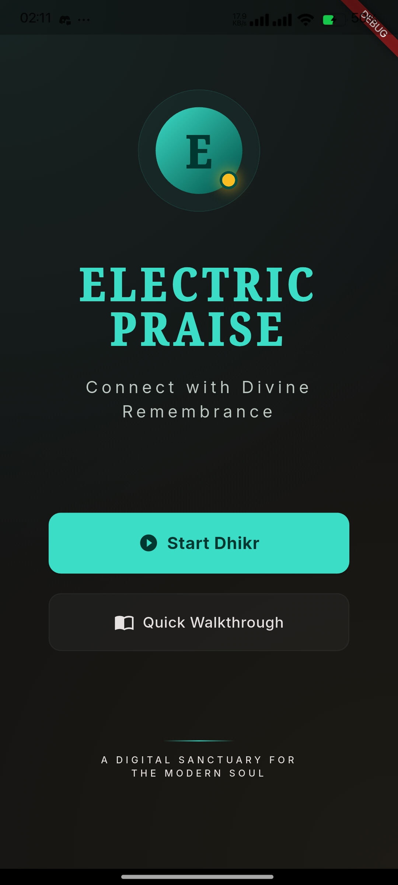

# ⚡ Electric Praise
> **A Digital Sanctuary for the Modern Soul.** > Connect with Divine Remembrance through a beautifully crafted, neon-infused Flutter experience.


Welcome to the **Electric Praise** repository! This is not just another Dhikr (remembrance) app. I wanted to create a spiritual tool that feels modern, premium, and visually stunning. By blending deep dark themes with vibrant neon accents and soft glassmorphism, this app aims to make daily remembrance a visually and spiritually rewarding habit.

---

## 📸 Glimpse of the App
*Currently building the UI step-by-step. More screenshots will be added as they are developed!*

<p align="center">
  
  
  
  
</p>

---

## 🚀 What I've Built So Far
I am building this project from the ground up, focusing heavily on a flawless UI/UX foundation before diving into the complex logic. Here is what is currently up and running:

* **✨ The Welcome Screen:** A fully responsive, pixel-perfect welcome page.
* **🌌 Custom Ambient Backgrounds:** Built a highly customized, glowing radial gradient background that fills the screen with soft cyan and yellow ambient lights (No basic solid colors here!).
* **🎨 Core Theme Architecture:** Completely configured the `AppColors`, `AppStyles`, and `ThemeData` to ensure consistency across the entire app.
* **🔘 Custom Reusable Components:** Created bespoke Primary and Secondary buttons with hover/tap effects, ensuring the UI stays clean and DRY (Don't Repeat Yourself).
* **📂 Scalable Folder Structure:** Set up a clean, modular architecture separating UI, styling, and components for future scalability.

---

## 🗺️ The Roadmap (What's Next?)
The journey has just begun. Here is what I am currently working on and what is planned for the near future:

- [x] Initial Project Setup & Theming.
- [x] Welcome Screen & Routing.
- [ ] **The Main Counter Screen:** Featuring a custom, animated Goal Progress Bar and a massive, tactile Dhikr button.
- [ ] **Dhikr Library:** A beautifully categorized list (Morning/Evening, After Prayer, Prophetic Duas) with custom cards and typography.
- [ ] **'My Journey' Dashboard:** A detailed statistics page tracking lifetime Dhikr, daily streaks, and weekly intensity charts.
- [ ] State Management Integration (Provider/Cubit).
- [ ] Local Storage (Hive/Shared Preferences) to save progress.

---

## 🎨 Design Language (The Vibe)
The aesthetic of **Electric Praise** is deeply inspired by modern sleek interfaces, combining deep darkness with glowing elements to reduce eye strain while looking gorgeous.

### Color Palette:
* ⬛ **Deep Void (Background):** `#131313` - A very dark, blueish-grey for maximum OLED depth.
* 🩵 **Neon Cyan (Primary Accent):** `#3CDDC7` - Used for primary buttons, highlights, and glowing effects.
* 💛 **Electric Gold (Secondary Accent):** `#F9BD22` - Used for progress indicators, notifications, and subtle touches.
* 🌲 **Dark Teal (Surface/Cards):** `#004E45` - Used to separate layers from the background.

### Typography:
Focusing on clean, highly readable Sans-Serif fonts for English text, paired with elegant, traditional Naskh-style fonts for Arabic texts to ensure maximum legibility during Dhikr.

---

## 💻 Tech Stack & Tools
* **Framework:** Flutter
* **Language:** Dart
* **Sizing:** `flutter_screenutil` (for responsive UI across all devices)
* **Icons:** Custom SVGs & `cupertino_icons`
* **Design:** Replicating a high-end Figma design to the pixel.

---

## 🛠️ How to Run this Project
If you want to clone this repository and see the magic yourself:

1. Ensure you have [Flutter](https://flutter.dev/docs/get-started/install) installed.
2. Clone the repo:
   ```bash
   git clone [https://github.com/YourUsername/electric_praise.git](https://github.com/YourUsername/electric_praise.git)